GROUP_06-OOP-N03

# Thành Viên Nhóm
**Lê Chí Hoàn** 22010063
**Đỗ Trung Chính** 22010499

# Hệ Thống Quản Lý Thư Viện

## Giới Thiệu, Mô Tả Dự Án
Dự án này là một hệ thống quản lý thư viện, giúp tối ưu hóa và cải thiện hoạt động của thư viện. Hệ thống cho phép quản lý các loại sách, các hoạt động mượn và trả sách.
Dự án sử dụng maven để quản lý thư viện.

## Chức năng chính
  - Có chức năng quản lý sách. Có thể thêm, sửa, xóa và tìm các loại sách.
  - Có thể kiểm soát số sách chưa mượn, đã mượn và thông tin cơ bản của người mượn.
  - Có thể gửi yêu cầu mượn sách.
  - Có chức năng quản lý người dùng, mượn sách
  - 
## UML Dự án

## 1.1 Database

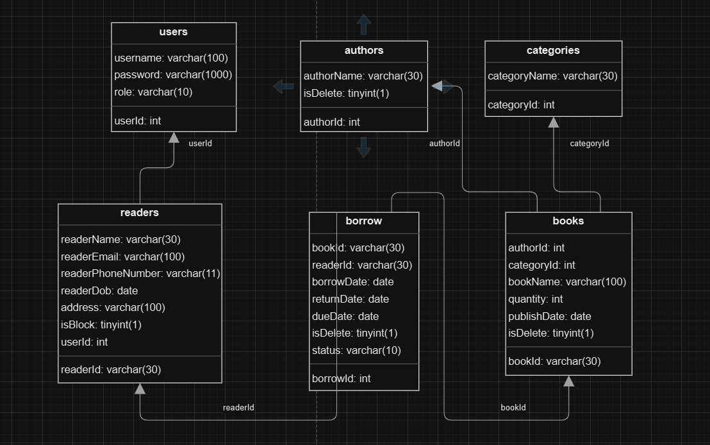

## 1.2 Usecase

## 1.2.1 Login (for both librarian role and reader role)

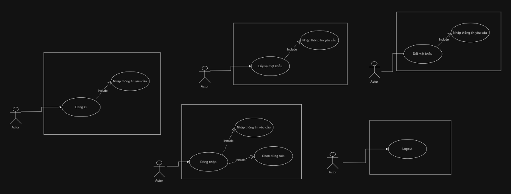

## 1.2.2 Book Management (for librarian role)

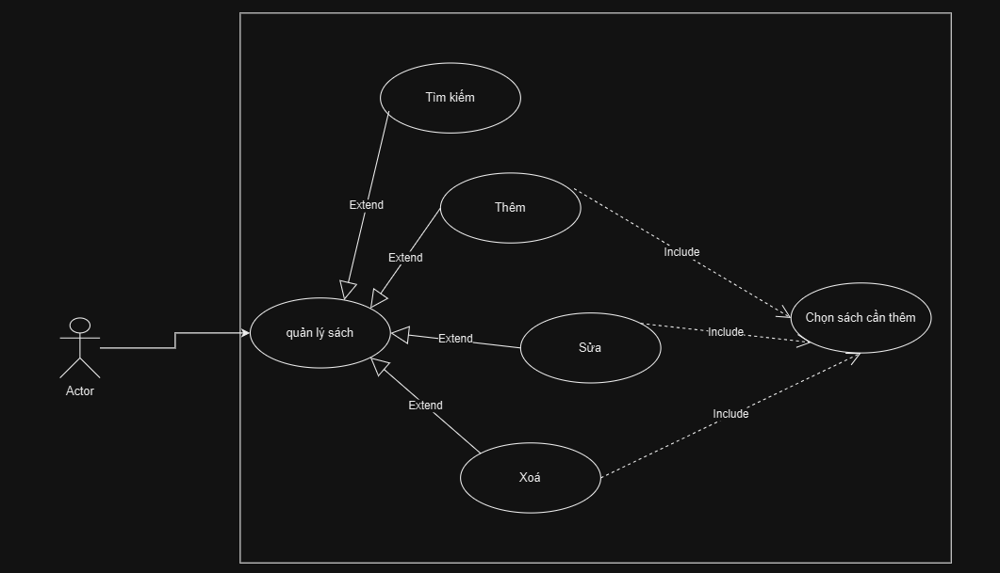

## 1.2.3 Book Requested (for librarian role)

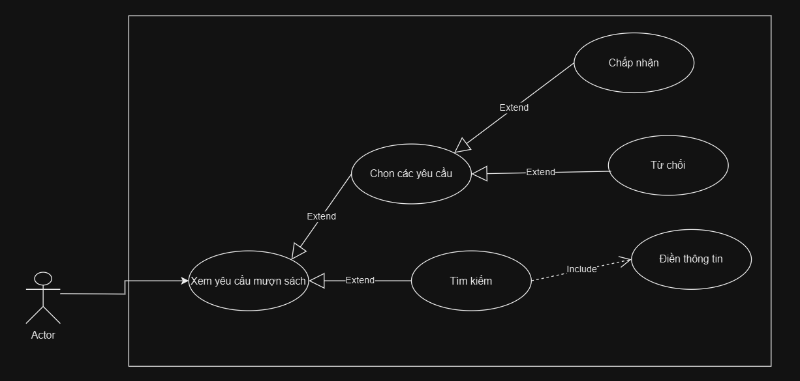

## 1.2.4 User Management (for librarian role)

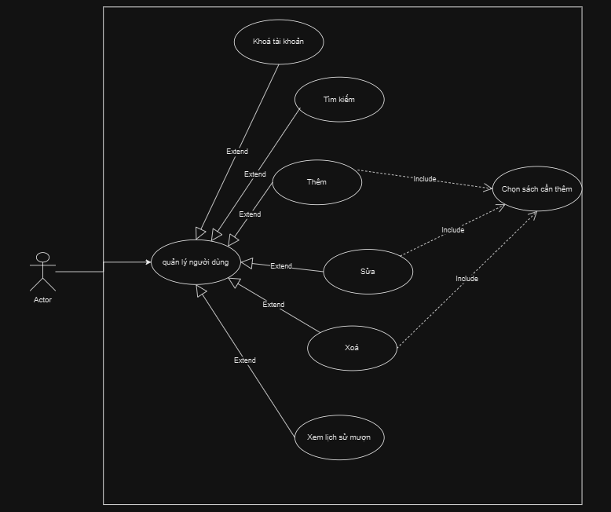

## 1.2.5 Statistics (for librarian role)

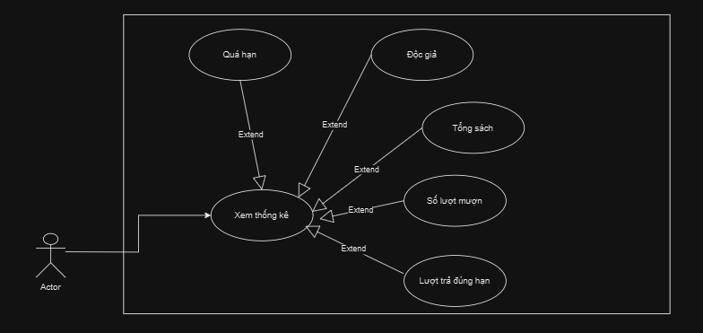

## 1.2.6 User Profile (for reader role)

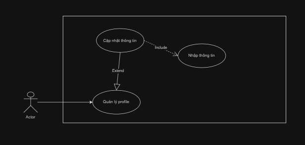

## 1.2.7 Borrow Requested (for reader role)

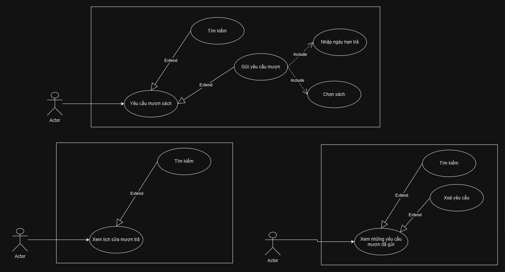

## Giao diện đầu tiên của dự án

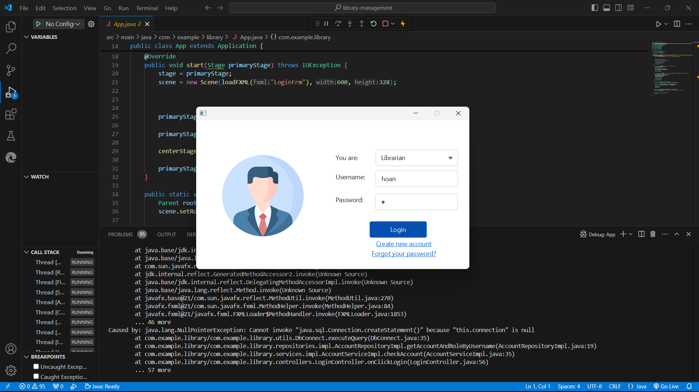

## Cách Cài Đặt
1. Clone repository từ GitHub:
   ```bash

## Cài database SQL
Do đã cài trước database trong quá trình làm project, nên nhóm em sẽ để ảnh demo lúc import database và connect database từ mySQL.
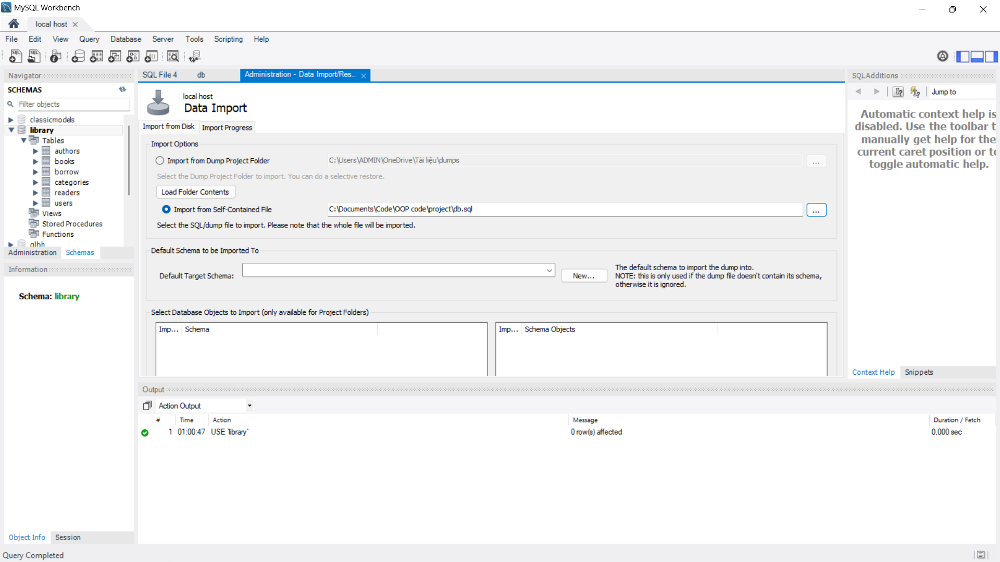
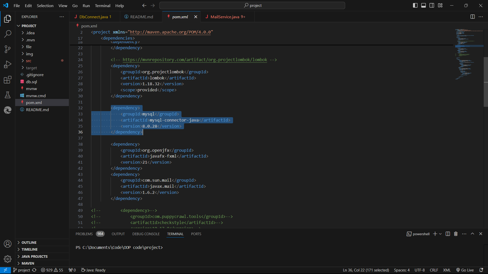
